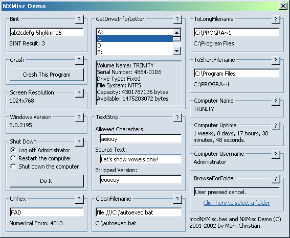



## NX Miscellaneous Module

### Description

NXMisc is a collection several useful functions that new and old programmers alike should find useful. Includes functions for cleaning up text, converting long filenames to short and back again, getting the computer name, getting the Windows version, name of the currently logged in user, getting uptime, and more. This includes an application that demonstrates the usage of all of them.
 
### More Info
 

             |
---                |---
**Submitted On**   |2002-05-19 19:25:54
**By**             |[Mark Christian](https://github.com/Planet-Source-Code/PSCIndex/blob/master/ByAuthor/mark-christian.md)
**Level**          |Intermediate
**User Rating**    |4.5 (18 globes from 4 users)
**Compatibility**  |VB 6\.0
**Category**       |[Libraries](https://github.com/Planet-Source-Code/PSCIndex/blob/master/ByCategory/libraries__1-49.md)
**World**          |[Visual Basic](https://github.com/Planet-Source-Code/PSCIndex/blob/master/ByWorld/visual-basic.md)
**Archive File**   |[NX\_Miscell849545192002\.zip](https://github.com/Planet-Source-Code/mark-christian-nx-miscellaneous-module__1-34918/archive/master.zip)

### API Declarations

See source code.

